# BIProject

# CMPE274-ECommerce

Kelly Alvarez, Nishant Rathi, Anthony Bell

## Introduction
Amazon suggests certain items to users based on their most recent search history or purchases.

### **Goal:** 
Design a Business Intelligence system that provide suggestions to customers based on geographical and historical online purchases and searches.

### **Objective:** 
Based on data analytics, customers will be able to view popular items based on geographical item popularity, i.e. suggested items based on data from US, China, etc.

Additionally, sellers will be able to use our system to strategically advertise their products based on user preferences, so that customers can receive relevant suggestions.   

Finally, they will be able to view suggested items based on their popularity via date, i.e. most purchased items between the months September - February or a holiday season.

## Procedure

- Collect real-time data based on user’s search and activity such as orders. 
- Compare information about customers, products and prices
- Record activity and login time based on geographic location
- Compare user’s preferences based on rating and product price

## High Level Architecture
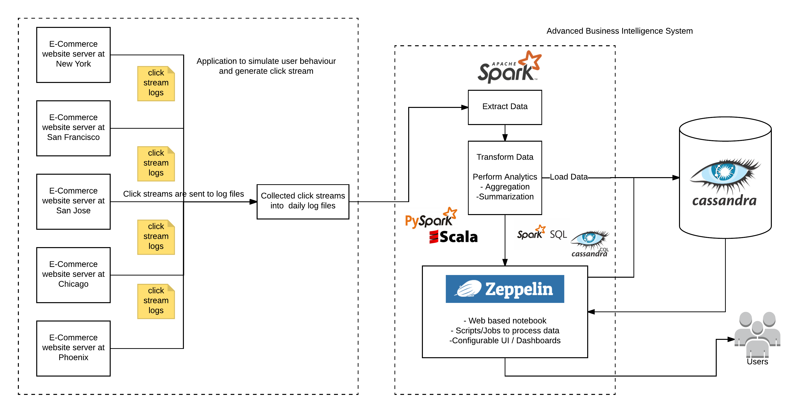

## Screenshots
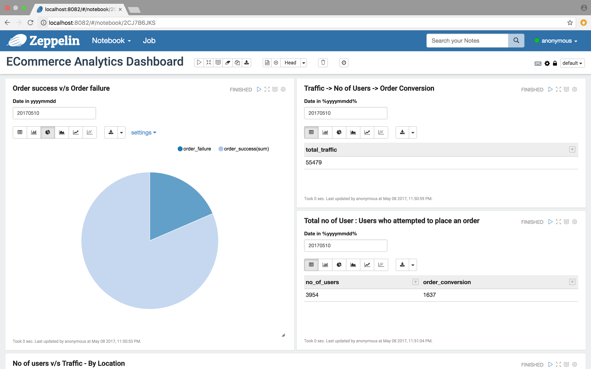
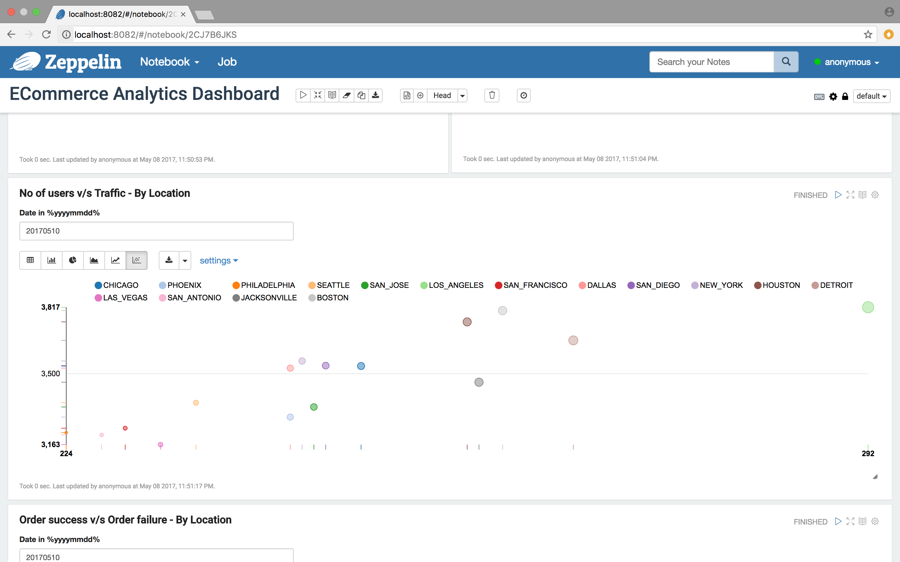
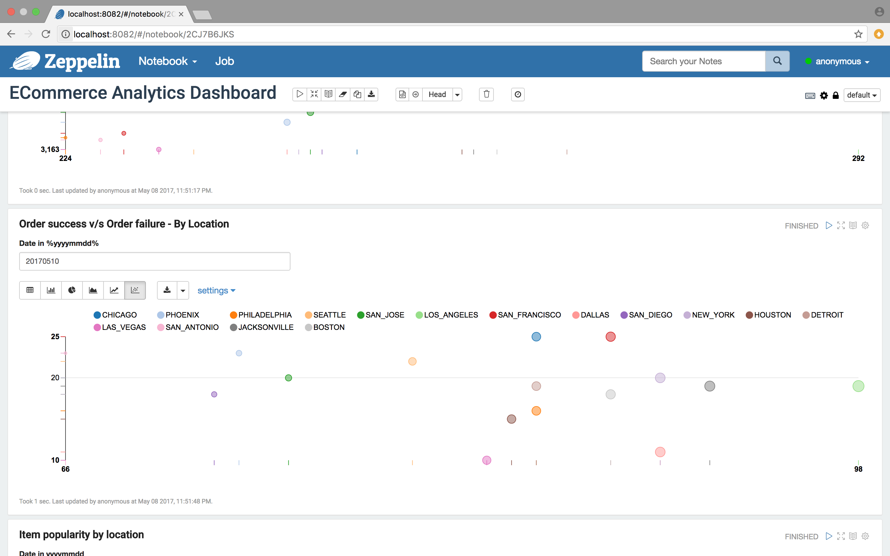
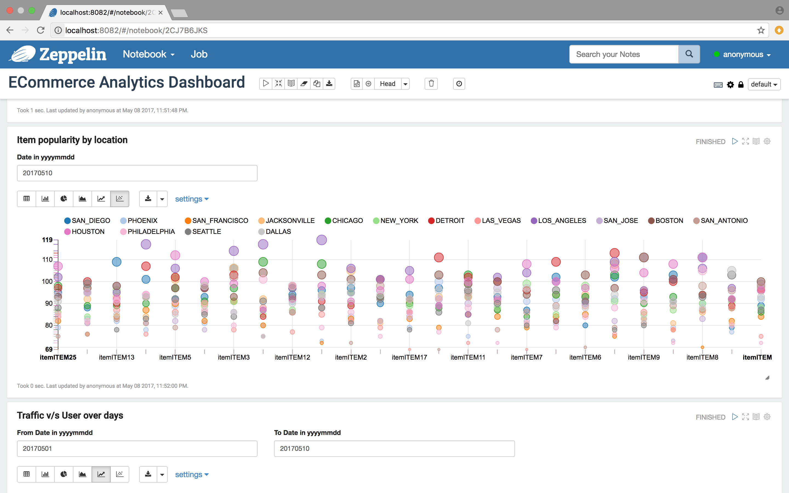
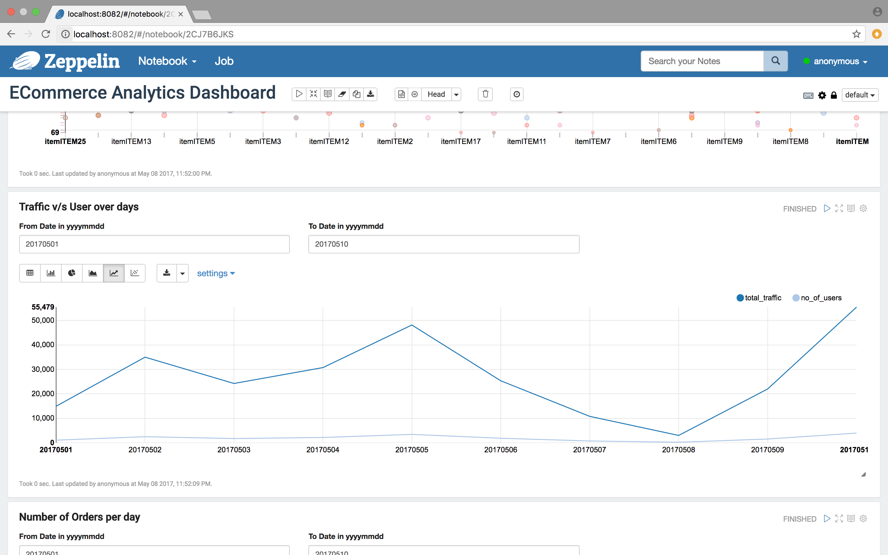
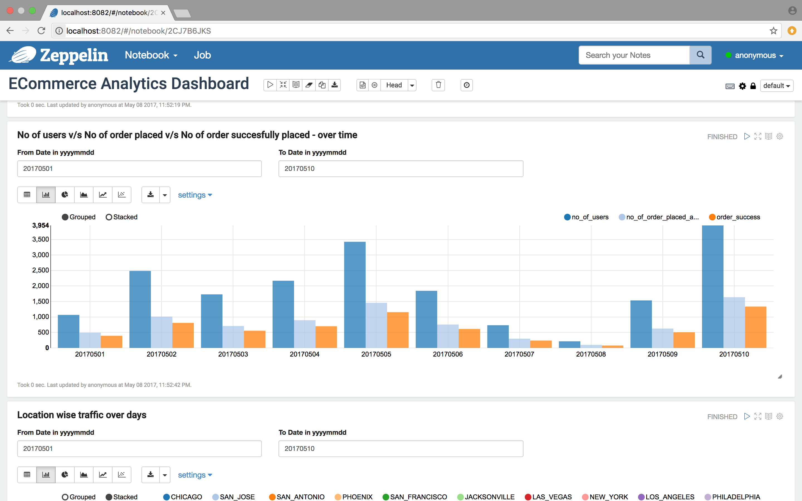
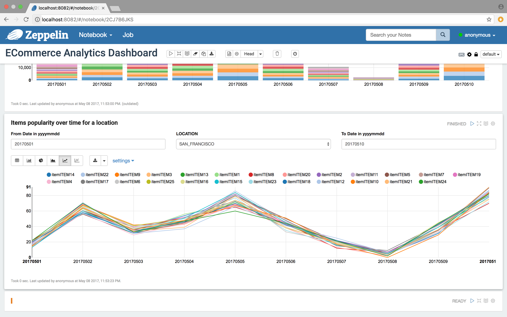
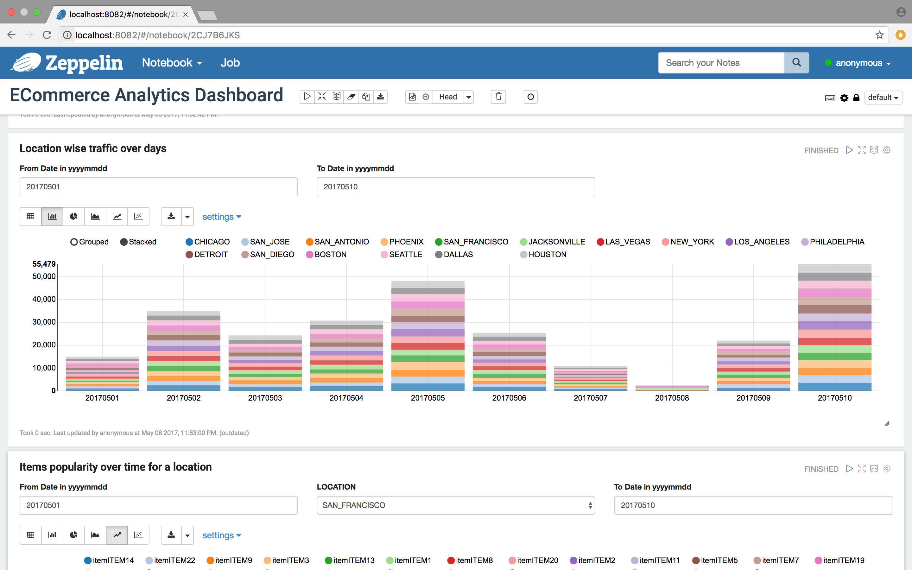
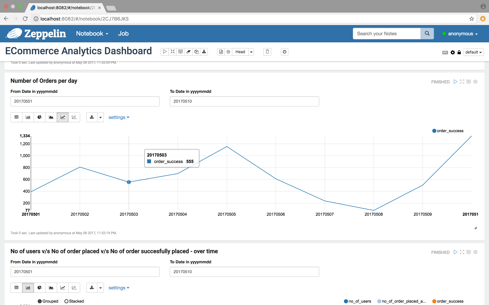
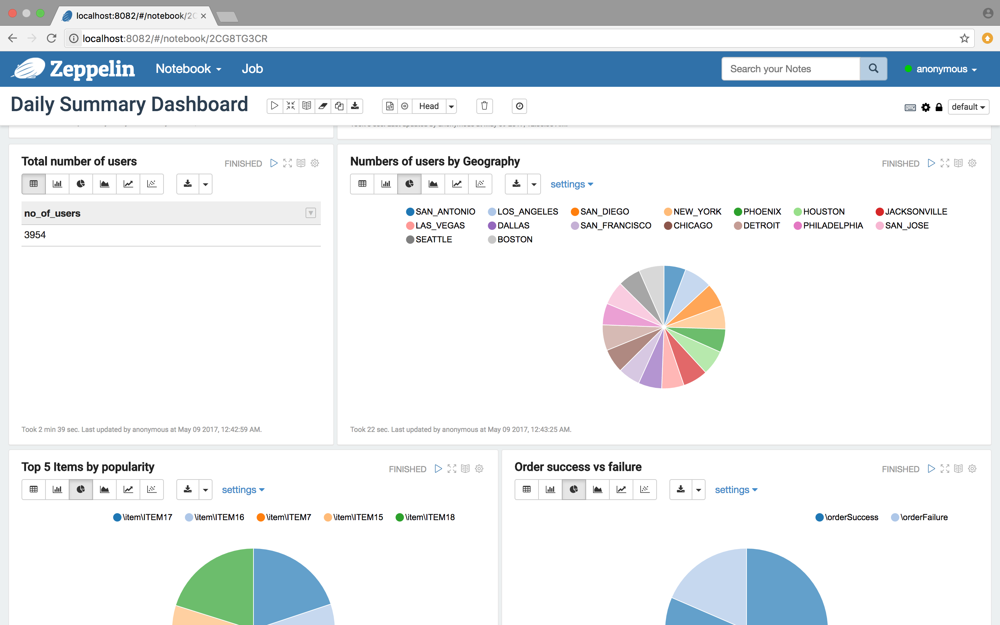
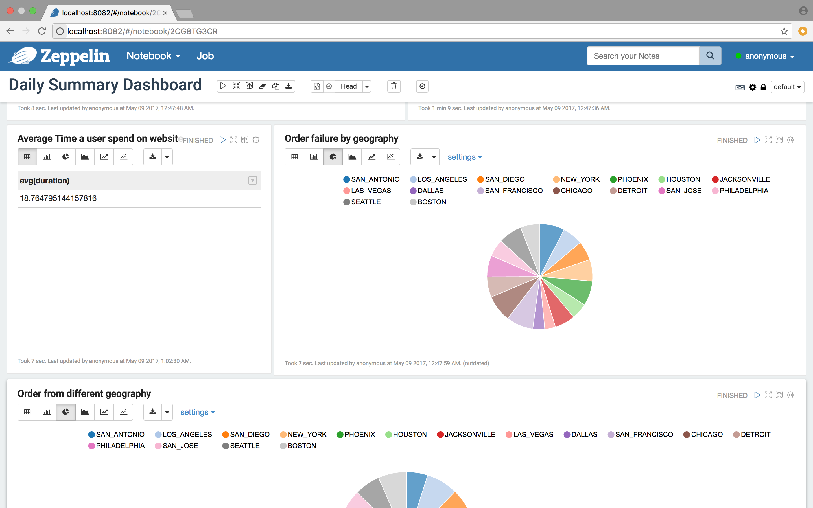
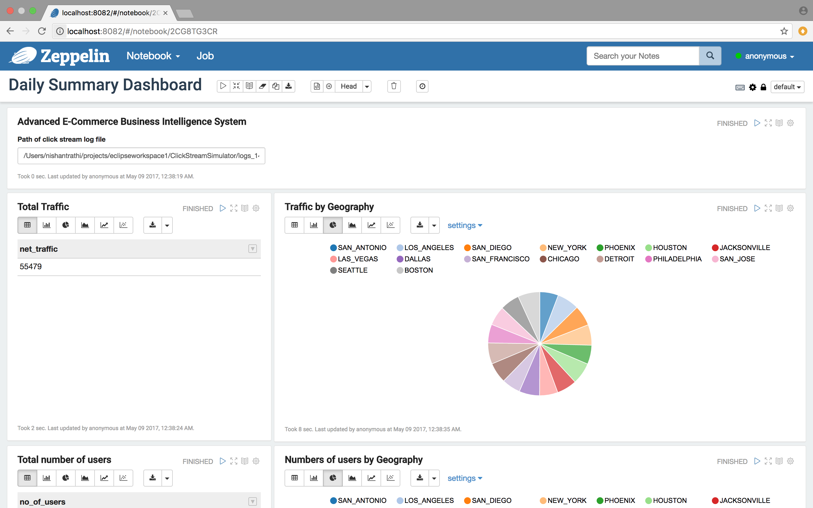
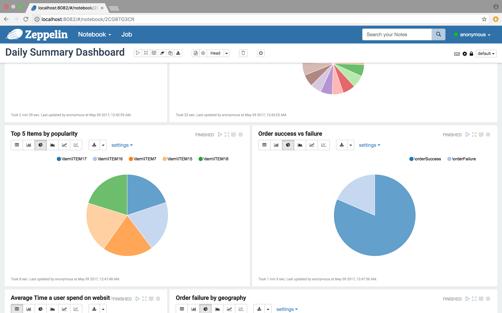
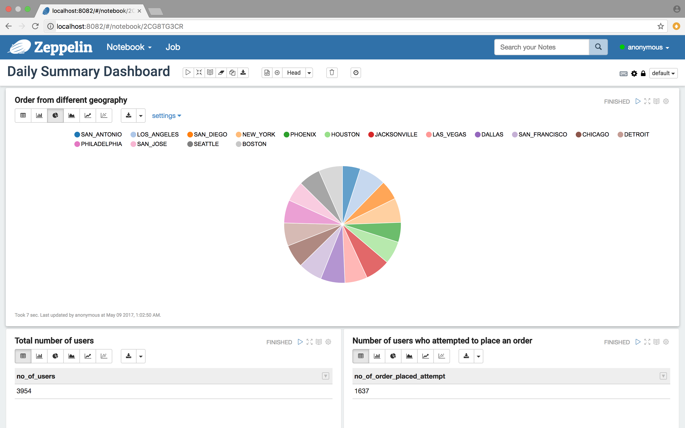

## Scorecard
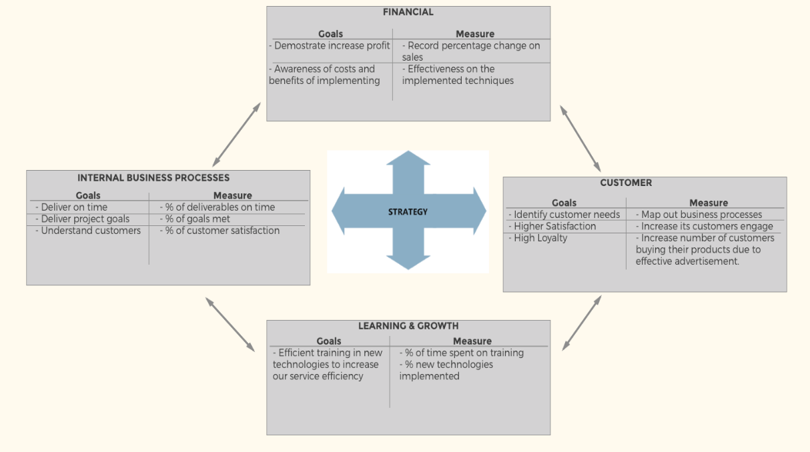
